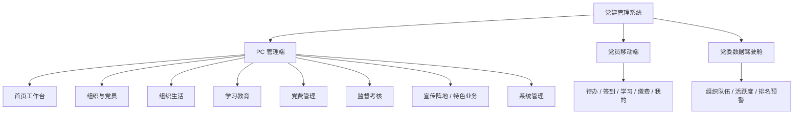

# 党建管理系统页面结构、交互说明与视觉规范

> 版本：V1.0  
> 设计范围：党委/支部管理员 PC 管理端、普通党员移动端、党委数据驾驶舱  
> 依据：`党建管理系统完整产品架构方案（PRD版）`

**【补充修订说明】** 本版依据已补充修订（蓝色标注）的《党建管理系统完整产品架构方案（PRD版）》同步自查并修订。所有新增/修订内容以蓝色字体标注，便于区分。主要补充：角色体系（党总支管理员/审计管理员）、发展党员法定公示节点与25节点步骤条、组织关系转接状态机（在途/待回执/异常）、账号开通与批量导入、党费基数核定与结余台账、党风廉政（信访举报受理闭环、党纪处分工作流）、积分明细溯源与申诉状态机、党员证明开具、移动端举报/志愿服务入口、终端范围（钉钉/企微/H5）澄清等。

## 1. 设计目标

面向国企及政府单位党务工作者，建立一套兼顾政治严肃性、日常办公效率与安全合规要求的党建管理系统界面规范。

核心目标：

- **强流程**：发展党员、组织转接、组织生活、党费等刚性流程按步骤办理，过程可追溯。
- **基层减负**：通过待办、自动提醒、模板化台账和一次录入多处复用降低重复操作。
- **分级管控**：党委、总支、支部、党员按组织范围和角色展示对应的数据与操作。
- **安全可信**：敏感信息脱敏，高风险操作二次确认，审批、导出和查看均可审计。

## 2. 视觉定位

### 2.1 设计方向

采用“**政务庄重型**”作为主风格：党建红用于品牌和关键动作，暖白与深灰承载高密度管理信息。管理员端避免大面积红色与装饰性元素；党委驾驶舱采用深色数字指挥风格。

### 2.2 色彩

| 用途 | 色值 | 说明 |
|---|---:|---|
| 品牌党建红 | `#C21F30` | Logo、主按钮、关键预警；不作为长篇内容背景 |
| 荣誉暖金 | `#C89A4B` | 达标、荣誉、重点提示 |
| 信息政务蓝 | `#2D6DB5` | 数据、处理中、链接与信息提示 |
| 成功绿 | `#2E8B57` | 完成、归档、已缴费 |
| 警示橙 | `#D97706` | 即将逾期、待完善、待审核 |
| 页面背景 | `#F5F6F8` | PC 工作区背景 |
| 卡片白 | `#FFFFFF` | 卡片、表格、弹窗背景 |
| 正文深灰 | `#1F2329` | 主要文字 |
| 辅助灰 | `#6B7280` | 时间、说明、次要信息 |

### 2.3 排版与栅格

- 中文字体：微软雅黑、思源黑体或系统无衬线字体。
- 字号：页面标题 20px、模块标题 16px、正文/表格 14px、辅助信息 12px。
- 设计基准：PC 宽度 1440px；左侧导航 216px，顶部栏 64px，内容区外边距 24px，卡片间距 16px。
- 圆角：卡片与表单控件采用 4–8px 小圆角；以细边框为主，弱化阴影。

### 2.4 状态语义

| 颜色 | 含义 | 典型状态 |
|---|---|---|
| 红色 | 风险/必须处理 | 逾期、驳回、红色预警 |
| 橙色 | 即将到期/待补充 | 待完善、待审核、即将逾期 |
| 蓝色 | 处理中/提示 | 进行中、待办理、信息提示 |
| 绿色 | 已完成 | 已归档、已通过、已缴费 |
| 灰色 | 非活跃/不可用 | 草稿、已撤销、无权限 |

<strong>流程/转接状态色值补充</strong>：公示中/转接在途/待回执→蓝色（处理中）；异议中/转接异常/已终止→红色（风险，须处置）；已归档/已接收→绿色（完成）。状态标签须含文字，不依赖颜色单独传达。

## 3. 信息架构

### 3.1 PC 管理端导航

| 一级导航    | 二级页面                      | 核心用户        |
| ------- | ------------------------- | ----------- |
| 首页工作台   | 待办中心、预警中心、工作日历            | 全体管理角色      |
| 组织与党员   | 组织树、党员名册、党员档案、发展党员、组织关系转接 | 党委/支部管理员    |
| 组织生活    | 年度计划、三会一课、主题党日、组织生活会、台账   | 支部管理员       |
| 学习教育    | 学习任务、资源库、考试、学时督导、心得       | 党委/支部管理员    |
| 党费管理    | 核算、收缴、欠缴催办、使用审批、收支公示      | 财务/支部管理员    |
| 监督考核    | 党员积分、支部考核、整改闭环、预警清单       | 党委/支部管理员    |
| 宣传与特色业务 | 党建资讯、风采、志愿服务、品牌创建、攻坚项目    | 宣传/业务管理员    |
| 系统管理    | 角色权限、消息、字典、日志、导出审计        | 超级管理员/党委管理员 |

<strong>导航补充</strong>：① 监督考核下新增「党风廉政」二级页（信访举报受理、党纪处分工作流）；② 系统管理下新增「账号开通与批量导入」「党员证明开具」二级页；③ 党费管理下新增「结余台账」二级页；④ 组织与党员「组织关系转接」二级页补充在途/待回执/异常状态视图；⑤ 终端接入范围澄清：PC 管理端为 Web，移动端覆盖钉钉/企业微信/独立 H5 三种入口，按单位开通情况动态呈现，不重复建设两套后台。

### 3.2 页面共性结构

1. **顶部工具栏**：面包屑、全局搜索、消息、帮助、当前组织与个人菜单。
2. **左侧导航**：当前模块高亮；菜单按权限动态显示。
3. **内容区**：列表页采用“筛选区 → 工具栏 → 数据表格 → 分页”，详情页采用“摘要卡 → Tab 内容 → 流程/操作记录”。
4. **全局右侧抽屉**：消息、待办或操作详情可在不离开列表页的前提下查看。

## 4. 关键页面设计说明

### 4.1 首页工作台（PC）

**目标**：让党委/支部管理员在一个页面完成“看到要办的事、识别风险、进入高频工作”。

- 顶部：您好语、所属组织、日期与快捷操作（新建活动、发起流程、导入党员）。
- 第一行：待办审批、即将逾期、红色预警、本月完成率四张指标卡。
- 第二行：左侧“我的待办”按紧急度排序；右侧“重点预警”展示风险原因、责任对象和处置入口。
- 第三行：本月组织生活日历、组织生活/学习/党费三项趋势图。
- 底部：常用功能快捷入口与最近浏览/导出记录。

### 4.2 组织与党员

#### 组织树与组织档案

- 左侧为可搜索、可展开的四级组织树；右侧显示组织概览、班子成员、党员概况、任期倒计时和沿革记录。
- 组织撤销、合并、划转等高风险操作放入“更多操作”，要求填写原因、上传材料、选择接收组织并发起审批。
- 存在未结流程时，操作按钮禁用并写明拦截原因。

#### 党员名册与党员档案

- 名册支持组织范围、身份、党籍状态、是否流动、积分区间等筛选。
- 表格默认显示姓名、所属组织、党员身份、入党时间、党费状态、学习完成率、积分；身份证号和手机号默认脱敏。
- 档案页顶部使用人员摘要卡；Tab 包含基础信息、党籍信息、组织生活、学习、党费、奖惩、异动、操作记录。
- 核心字段变更、查看明文和档案导出均要求二次验证并写入审计日志。

#### 发展党员

- 使用 25 节点阶段化步骤条：申请入党、培养考察、发展对象、接收预备、转正归档。
- 当前节点区域仅展示本阶段需办理的表单、材料和规则；右侧固定流程时间轴显示节点、办理人、意见和附件。
- 时间不足、材料缺失、人数不达标时，提交按钮禁用，直接列出校验失败项。

<strong>发展党员补充（法定公示与25节点状态机）</strong>：① 法定公示节点：在「确定入党积极分子」「确定发展对象」「接收预备党员」「预备党员转正」四处必须设置公示环节（公示期一般不少于 5 个工作日），公示中状态为蓝色，公示期内收到异议进入「异议中（红色）」分支，异议处置完成方可继续；② 25 节点步骤条须标注每节点主办角色（申请人/入党介绍人/党小组/支部/上级党委/组织部门）与法定前置条件；③ 状态机包含「退回/终止」分支，终止须填原因并归档留痕；④ 公示与材料缺失、时间不足一并纳入提交前校验清单。

<strong>组织关系转接（页面补充）</strong>：独立子页，列表含转接类型（省内/跨省/系统内）、状态（待发起/在途/待回执/已接收/转接异常/已终止）。详情采用状态机视图：发起→组织内审批→上级党委转出→对方党委接收→回执归档；「在途」「待回执」为蓝色处理中，「转接异常」「已终止」为红色须处置，「已接收」为绿色完成。跨省对接异常须提供异常原因、重新发起与人工兜底入口，并同步通知双方管理员。

### 4.3 组织生活

**主流程：计划 → 执行 → 归档。**

- 年度计划：日历与列表双视图；自动标识频次不足和待上级审批项目。
- 活动列表：会议类型、主题、时间、签到率、台账完整度、当前状态。
- 活动详情：顶部显示状态和通知情况；中部通过 Tab 管理基本信息、参会签到、会议资料、纪要与影像；右侧呈现操作时间轴。
- 台账归档：展示“必填要素完整度清单 + 台账预览 + 导出入口”；资料不完整时禁止归档。

<strong>组织生活补充（请假闭环）</strong>：活动详情新增「请假申请与审批」入口，党员可针对具体会议/活动提交请假（原因、起止、佐证材料），支部管理员在待办中审批；请假通过后该党员不计入应签到基数，避免拉低签到率；请假记录写入人员异动与操作日志，形成「申请→审批→归档」闭环，并纳入组织生活台账。年度计划视图须标识「请假占比」超阈值活动。

### 4.4 学习教育

- 任务中心：以卡片显示任务主题、学习期限、覆盖范围、完成人数与催办按钮。
- 进度督导：支持按组织下钻，突出低完成率组织与临期未完成党员。
- 资源库：资源类型、主题、发布组织、审核状态、可见范围和学习次数。
- 考试管理：考试配置、参与情况、客观题自动评分、主观题待阅卷。

### 4.5 党费管理

- 收缴概览：本月应缴、实缴、收缴率、欠缴人数、与上期趋势。
- 缴费明细：按组织、月份、状态筛选；支持发起催缴和登记线下缴费。
- 欠缴催办：用风险分级突出连续欠缴人员，保留催办记录与处理结果。
- 使用与公示：收支流水、票据附件、分级审批时间轴、季度公示预览与导出。

<strong>党费补充（基数核定与结余台账）</strong>：① 新增「基数核定」页：按工资收入区间与交纳比例自动测算应缴基数，支持手动修正并留痕，核定结果经二级复核后生效；② 新增「结余台账」页：展示历年结余、本期收入/支出、结转金额与银行/现金对账，与「使用审批」「收支公示」联动，结余变动须有对应审批单号；③ 欠缴催办补充：连续欠缴超阈值自动升级预警并触发逐级督办。

### 4.6 监督考核

- 党员积分：总分、基础/加分/扣分明细、排名、申诉状态；变更记录不可编辑。
- 支部考核：自评、上级考评、结果反馈、整改销号四步；问题需设责任人和整改期限。
- 预警清单：将换届、党费、学时、组织生活、发展党员等预警统一聚合，可按风险等级和责任组织处理。

<strong>监督考核补充（积分溯源、申诉状态机、党风廉政）</strong>：① 积分「变更记录」扩展为可追溯明细，每条积分须关联来源业务（组织生活/学习/奖惩/志愿服务）单据 ID，支持一键溯源；② 积分申诉状态机：发起→待审核（蓝色）→通过/驳回（绿/红）→完成，驳回须填原因并可二次复核；③ 新增「党风廉政」子模块入口，含「信访举报受理闭环」（登记→分办→初核→立案/了结→反馈，蓝色处理中、红色风险须处置、绿色了结）与「党纪处分工作流」（警告/严重警告/撤销党内职务/留党察看/开除党籍的分级审批与执行归档）；④ 预警清单补充换届预警、信访超期预警。

### 4.7 党员移动端

- 首页：顶部展示姓名、所属支部与本月积分；核心入口为“待办、签到、学习、党费”。
- 待办：仅展示本人需处理任务，按“今日待办/即将截止/已完成”分组。
- 签到：二维码、人脸或定位方式由活动配置决定，签到结果即时反馈。
- 学习：课程进度、剩余时长、随机答题、心得提交；不提供复杂管理操作。
- 党费：应缴金额、支付入口、历史凭证与欠缴提醒。
- 我的：个人档案脱敏预览、请假申请、消息与个人设置。

<strong>移动端补充（举报与志愿服务）</strong>：① 「我的」页新增「我要举报」入口，支持匿名/实名提交信访举报（问题描述、分类、佐证图片），提交后展示受理编号与进度查询；② 首页新增「志愿服务/双报到」入口，党员可报名、打卡、上传服务记录并自动累计服务时长与积分；③ 请假申请入口从「我的」前置到首页快捷区，便于活动前快速提交。

### 4.8 党委数据驾驶舱

- 深蓝灰背景，标题区显示党徽、系统名称与统计时间。
- 顶部核心指标：党组织总数、党员总数、本月组织生活数、当月党费收缴率。
- 左区：组织层级、党员年龄/身份分布。
- 中区：组织生活参会率、学习完成率、党费收缴率趋势和年度达标仪表盘。
- 右区：支部综合考核排行、党员积分排行、待办/超期/预警数量。
- 底部：红色滚动预警栏；点击任一图表可下钻至 PC 管理端对应清单。

<strong>驾驶舱补充（预警项）</strong>：右区预警数量扩展为「待办/超期/红色预警/信访在办/转接异常/换届临期」六类聚合；底部红色滚动预警栏新增「发展党员逾期」「党费连续欠缴」「组织关系转接异常」「信访超期未处置」专项滚动条目，点击均可下钻至 PC 对应清单。

## 5. 组件与交互规范

| 组件 | 用途与规范 |
|---|---|
| 待办卡 | 显示数量、截止时间、紧急等级，点击直达办理页 |
| 指标卡 | 显示核心数量、完成率、同比趋势；翻牌效果仅用于驾驶舱 |
| 组织树 | 搜索、展开、定位；无权节点仅展示名称，不可进入详情 |
| 筛选区 | 默认展示高频条件，支持重置与保存常用筛选 |
| 业务表格 | 支持固定表头、批量操作、状态标签、行内快捷操作与分页 |
| 详情摘要卡 | 突出对象身份、当前状态、所属组织、关键风险和主操作 |
| 流程时间轴 | 展示节点、办理人、时间、意见、附件、催办；归档节点不可修改 |
| 附件区 | 显示预览、版本、密级、下载权限；下载与导出均留痕 |
| 台账预览 | 以完整度清单、预览区、导出区三段式呈现 |

<strong>组件补充</strong>：新增以下通用组件——① 状态机组件：可视化展示多分支流程（含退回/终止/异常），节点含角色与状态色；② 公示组件：公示期倒计时、异议入口与异议处置记录；③ 导入组件：模板下载、批量校验、失败行定位与回滚；④ 证明开具组件：证明类型选择、自动填充党员信息、电子签章与下载留痕；⑤ 举报组件：匿名/实名切换、分类选择、进度查询；⑥ 申诉组件：申诉发起、审核状态与时间轴。

## 6. 状态、异常与安全交互

### 6.1 关键交互

- 所有预警按红色预警、橙色提醒、蓝色待办分级。红色预警必须填写处置结果或完成业务，不提供“一键忽略”。
- 高风险操作（组织调整、档案核心信息修改、批量导出、党费大额支出）须弹出二次确认并记录操作日志。
- 操作日志最少包含操作者、时间、对象、动作、来源 IP、结果；详情页提供只读查看入口。

### 6.2 异常处理

| 场景 | 页面反馈 |
|---|---|
| 无权限 | 隐藏高风险按钮，显示权限范围与联系上级管理员的说明 |
| 业务校验失败 | 在对应字段和页面顶部同时显示明确的失败原因 |
| 数据被他人修改 | 提示刷新并对比最新数据，禁止静默覆盖 |
| 网络中断 | 自动保存草稿；恢复后重新校验字段再允许提交 |
| 无数据 | 提供新建、导入、查看操作指引三个下一步入口 |
| 流程逾期 | 在对象、列表、首页预警中同步标识，并逐级催办/督办 |

## 7. 页面设计清单

| 端 | 模块 | 建议优先级 |
|---|---|---|
| PC | 首页工作台、待办中心、预警中心 | P0 |
| PC | 组织树、组织档案、党员名册、党员档案 | P0 |
| PC | 发展党员、组织关系转接 | P0 |
| PC | 三会一课列表、活动详情、签到、台账归档 | P0 |
| PC | 党费概览、缴费明细、欠缴催办、公示 | P0 |
| PC | 学习任务、学习进度、资源库、考试 | P1 |
| PC | 积分、支部考核、整改闭环、预警清单 | P1 |
| PC | 宣传阵地、志愿服务、党建品牌、系统管理 | P2 |
| 移动 | 首页、待办、签到、学习、党费、我的 | P0 |
| 驾驶舱 | 党委级全屏综合看板及下钻入口 | P1 |

<strong>页面清单补充（优先级）</strong>：PC 新增 P0——组织关系转接列表/详情、党风廉政（信访举报/党纪处分）、账号开通与批量导入、党员证明开具；P0——党费基数核定、结余台账；P1——积分申诉、请假审批。移动端新增 P0——我要举报、志愿服务/双报到、请假申请；驾驶舱 P1 补充信访/转接异常下钻页。

## 8. 验收要点

- 管理员能从首页在两步内进入任一 P0 高发业务。
- 发展党员、组织转接、组织生活、党费业务均能明确展示当前状态、办理记录和下一步动作。
- 党员端只显示个人相关任务和数据，不出现复杂后台管理功能。
- 敏感数据脱敏、权限隔离、二次验证、操作留痕在页面层有明确的可见反馈。
- 列表、详情、流程、台账四类通用页面在所有模块中保持一致的布局和状态语义。

<strong>验收要点补充</strong>：① 发展党员四类法定公示节点均可在页面发起、展示公示中状态并处理异议；② 组织关系转接在途/待回执/异常/终止状态均有明确视图与处置入口；③ 积分申诉、信访举报、党纪处分均形成可见闭环（发起→处理→结果→归档）；④ 党费基数核定与结余台账可对账并可溯源至审批单；⑤ 账号开通/批量导入/党员证明开具在系统管理可见且留痕；⑥ 移动端举报与志愿服务入口可用且数据回流 PC。

